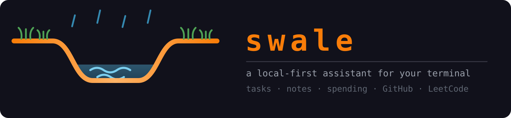
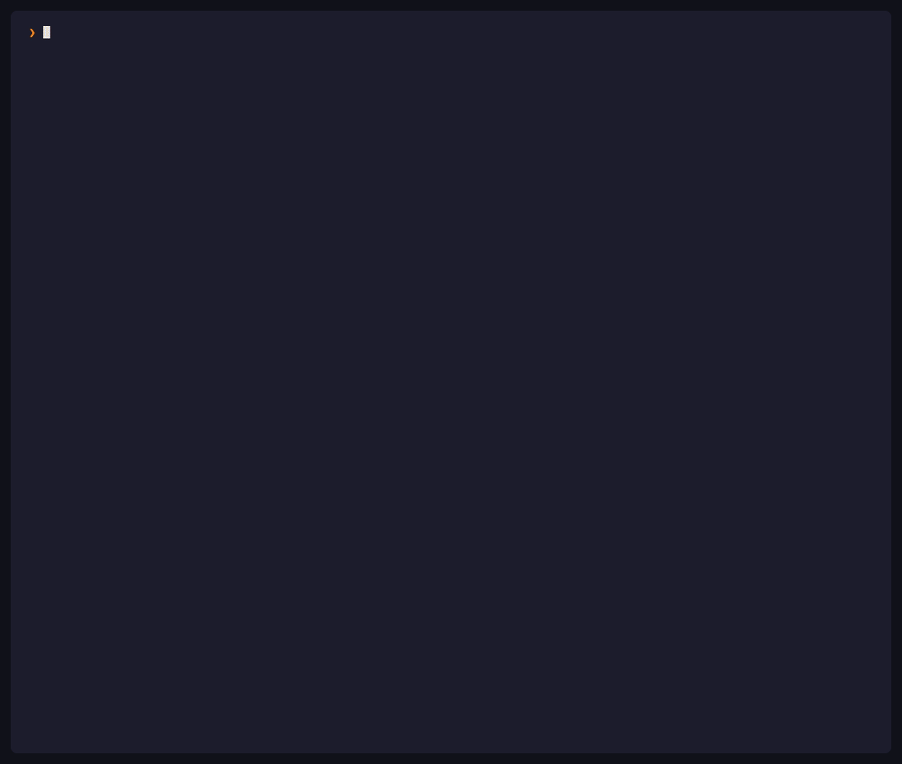
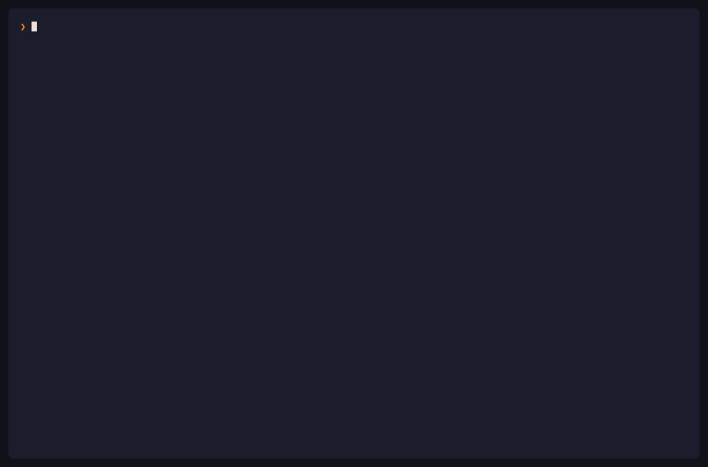
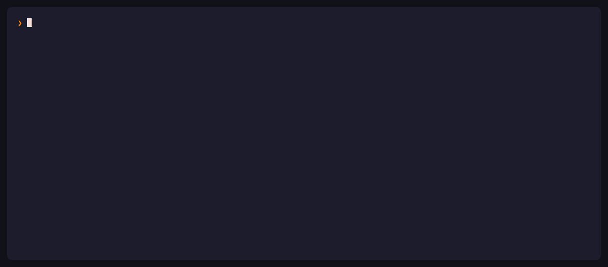
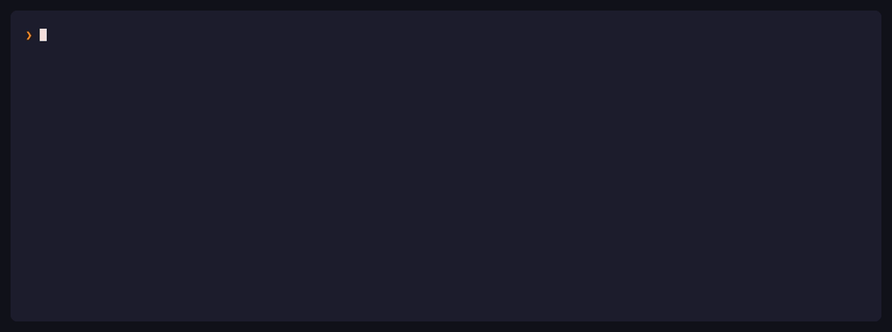

<p align="center">
  
</p>

<p align="center">
  <b>Your tasks, notes, spending, GitHub activity and LeetCode progress in one place.</b><br>
  With an agent that can read and change all of it, running on a model you host.
</p>

<p align="center">
  <a href="https://www.npmjs.com/package/@itssayantan/swale"></a>
  <a href="https://www.npmjs.com/package/@itssayantan/swale"></a>
  <a href="./LICENSE"></a>
  <a href="https://nodejs.org"></a>
  
  
</p>

<p align="center">
  <code>npm install -g @itssayantan/swale</code>
</p>

<p align="center">
  
</p>

<table>
<tr>
<td width="33%" valign="top">

### 🔒 Local-first

One SQLite file on your machine. No account, no server, no sync, no telemetry.

</td>
<td width="33%" valign="top">

### 🤖 It can actually do things

Thirteen tools over your own data. Ask it to mark something done and it runs the write.

</td>
<td width="33%" valign="top">

### 🧠 Bring your own model

Ollama on your laptop, or OpenAI, Anthropic, Groq. Nothing is hardcoded to one provider.

</td>
</tr>
<tr>
<td valign="top">

### 📅 Your activity, at a glance

GitHub commits and LeetCode submissions as contribution calendars, with streaks.

</td>
<td valign="top">

### 🔑 Keys stay out of the database

Your token and API keys live in a separate `0600` file, so exporting data never leaks them.

</td>
<td valign="top">

### 📦 Moves between machines

`swale backup` zips it up, `swale restore` puts it on the next one.

</td>
</tr>
</table>

---

## Contents

- [Why Swale](#why-swale)
- [Requirements](#requirements)
- [Installation](#installation)
- [Getting started](#getting-started)
- [Commands](#commands)
  - [`swale`](#swale-dashboard)
  - [`swale todo`](#swale-todo)
  - [`swale note`](#swale-note)
  - [`swale expense`](#swale-expense)
  - [`swale github`](#swale-github)
  - [`swale leetcode`](#swale-leetcode)
  - [`swale llm`](#swale-llm)
  - [`swale chat`](#swale-chat)
  - [Queueing and stopping](#queueing-and-stopping)
  - [Slash commands](#slash-commands)
  - [Attaching files](#attaching-files)
  - [`swale backup`](#swale-backup)
  - [`swale restore`](#swale-restore)
  - [`swale logout`](#swale-logout)
  - [Global options](#global-options)
- [Connecting an LLM](#connecting-an-llm)
- [How the agent works](#how-the-agent-works)
- [Data storage](#data-storage)
- [Backup and restore](#backup-and-restore)
- [Configuration](#configuration)
- [Roadmap](#roadmap)
- [Contributing](#contributing)
- [License](#license)

---

## Why Swale

Swale keeps the things a developer accumulates during a working day — a task, a thought, a receipt, a pull request, a solved problem — in one place reachable from the terminal you already have open.

|                              |                                                                                                                           |
| ---------------------------- | ------------------------------------------------------------------------------------------------------------------------- |
| **No server, no account**    | Your records live in a single SQLite file on your machine. Nothing is uploaded, nothing is tracked.                       |
| **An agent with real tools** | Thirteen of them, over your own data. Ask it to mark something done and it runs the write, rather than describing one.    |
| **Any model you like**       | Point it at Ollama on your laptop, or OpenAI, Anthropic or Groq. A local model costs nothing to run.                      |
| **Credentials kept apart**   | Your GitHub token and API keys live in a separate `0600` config file, so exporting or copying your data never leaks them. |
| **Portable**                 | `swale backup` zips it up, `swale restore` puts it on the next machine.                                                   |
| **Nothing to compile**       | Node's built-in SQLite, so there are no native modules to break on upgrade.                                               |

---

## Requirements

**Node.js 24 or later.** Swale stores your data using Node's built-in `node:sqlite` module, which is why a recent Node release is required.

```bash
node --version
```

A GitHub account is needed for the one-time sign-in. A LeetCode account and an LLM are both optional.

---

## Installation

Install globally to get the `swale` command on your `PATH`:

```bash
npm install -g @itssayantan/swale
```

Using another package manager:

```bash
pnpm add -g @itssayantan/swale
yarn global add @itssayantan/swale
```

Or run it without installing:

```bash
npx @itssayantan/swale todo list
```

> The package is published as `@itssayantan/swale`; the command it installs is `swale`.

---

## Getting started

The first time you run any command, Swale signs you in with GitHub using the **device flow** — the same mechanism the `gh` CLI uses. You are never asked for a password, and Swale never sees one.

```
$ swale todo list

Open https://github.com/login/device
Enter code: WDJB-MJHT
```

Approve the code in your browser and Swale builds your profile from your GitHub account. Nothing else is asked of you up front.

It then offers to link LeetCode, which you can skip:

```
What is your leetcode username? It will be saved locally. [Press Enter to Skip]:
```

That is the whole setup. Everything after this is optional and asked for only when a command needs it — a currency the first time you add an expense, an LLM the first time you chat.

Add your first todo:

```bash
$ swale todo add
Enter todo: Review the authentication pull request
Todo added successfully! To view the entire list use `swale todo list`
```

**Signing in as someone else.** Run `swale logout`, then any command. If you have signed in before, Swale offers a list of the accounts it knows and reuses the right records rather than starting fresh.

---

## Commands

```
swale <command> [action] [id]
```

Actions that create or modify a record prompt you for the details interactively rather than taking them as arguments.

Record IDs are UUIDs, shown in the output of every `list` and `read`. Copy the ID from there when using `read`, `update`, or `delete`.

### `swale` (dashboard)

Run `swale` with no arguments. It clears the terminal once, draws the mark, both contribution calendars and your numbers, then leaves a full-width prompt pinned to the bottom of the screen.

```
     ʼ      ʼ       ʼ     ʼ
  ψ ψ                ψ ψ        s w a l e
───╮                    ╭───    ─────────────────────
   ╰──╮              ╭──╯       v0.3.0  ·  local-first
      ╰──────────────╯          Sayantan Ghosh
       ≈≈≈≈≈≈≈≈≈≈≈≈≈≈

 GitHub — sayantanghosh-in
     Apr     May       Jun     Jul     Aug       Sep
     · · ■ · · ■ ■ · · · ■ ■ · · ■ · · ■ ■ ■ · · ■ ■ ■ ■
 ...
     Less · ■ ■ ■ ■ More

 🔥 streak 13d │ best 13d │ active 127d │ total 504 commits

 todo 3 open  │  notes 12  │  this month INR 4,280 over 9

 › show me what I shipped this week
   ⚙ github_contributions
 You pushed 23 commits across 4 days...

                                        localhost:11434 · qwen2.5:7b
 ╭──────────────────────────────────────────────────────────────────╮
 │ ›                                                                │
 ╰──────────────────────────────────────────────────────────────────╯
  enter send · ctrl+j newline · ctrl+y copy reply · /help · esc quit
```

The conversation grows **above** the input, not inside a box. Finished turns are handed to Ink's `<Static>`, which writes them once and never repaints them — they become ordinary terminal scrollback, so your mouse wheel, your scrollbar and your terminal's own text selection all work on them exactly as they would on any other command's output.

You can keep typing and sending while the agent works — prompts queue and run in order, with the count shown beside the spinner. `esc` stops whatever is running without touching the queue: anything already streamed is kept, the turn is marked `Stopped.`, and the next prompt begins. With nothing running, `esc` quits.

A streaming reply is handed over the same way, a paragraph at a time. Ink repaints its whole live frame on every change, so letting a long answer pile up there means erasing and redrawing thirty-odd lines several times a second — which reads as stutter. Only the paragraph still being written stays live, and the split never happens inside a code fence.

The prompt spans the terminal and sits at the bottom. The dashboard's real height is measured — wrapped rows and double-width emoji included — and the difference becomes a gap, so the first paint fills the screen rather than stranding the prompt halfway up it. One row is always held back, because filling the terminal exactly puts the closing newline past the last row and scrolls the banner off the top.

On a short or narrow window the dashboard gives something up rather than overflow: first the spacing between sections, then the mark, then the calendars.

A fixed block of rows is held above the prompt for the slash palette, attached files and the paragraph currently streaming — reserved whether or not anything is in them. Ink anchors its live frame at the top, so anything that changes height above the prompt moves the prompt: typing `/` and deleting it again used to shunt the whole composer up and down the screen.

The input grows with what you type instead of scrolling one line, and the model you are talking to is named above its top-right corner.

| Key              | Does                                    |
| ---------------- | --------------------------------------- |
| `enter`          | Send, or queue if the agent is busy     |
| `ctrl+j`         | New line without sending                |
| `ctrl+y`         | Copy the last answer to the clipboard   |
| `↑` / `↓`        | Walk back through prompts you have sent |
| `ctrl+v`         | Attach the image on your clipboard      |
| `ctrl+a`/`e`     | Jump to start / end                     |
| `ctrl+w`/`u`/`k` | Delete word back / to start / to end    |
| `esc`            | Stop the current turn; quit when idle   |

The mark is a swale in cross-section: ground sloping in from both sides, grass on the banks, rain coming down, water held in the dip. That is what a swale is — a shallow planted channel that catches rain where it falls and lets it soak in rather than run off.

Piping it (`swale > today.txt`) prints a plain-text version instead of escape codes.

#### Queueing and stopping


Send a second question while the first is still running and it waits its turn — the count sits beside the spinner, and the prompt itself is shown so you can see what is pending. `esc` stops whatever is in flight without touching the queue: anything already streamed is kept, the turn is marked `Stopped.`, and the next one begins.

#### Slash commands

| Command         | Does                                                      |
| --------------- | --------------------------------------------------------- |
| `/model`        | Show the current model, and every model installed locally |
| `/model <name>` | Switch to it                                              |
| `/clear`        | Forget the conversation so far                            |
| `/help`         | List these                                                |
| `/quit`         | Leave                                                     |

`/model` with no argument lists what Ollama already has pulled and marks the active one. `/model` only changes the model — to change provider entirely, run `swale llm`.

#### Attaching files

Copy a file in Finder, or drag it into the terminal, and paste. Swale recognises the path, attaches the file, and drops the reference into the prompt where you can see it:

```
 🖼 Screenshot 2026-09-25.png   image · 370 KB · not read yet
 📊 sales.csv                   spreadsheet · 1.2 MB · not read yet

                                          localhost:11434 · qwen2.5:7b
╭────────────────────────────────────────────────────────────────────╮
│ › [Image #1] ~/work/sales.csv  — what changed between these?       │
╰────────────────────────────────────────────────────────────────────╯
```

The reference goes inline, the way you would write it yourself: the path for a file, `[Image #1]` for something off the clipboard. The lines above the box are a receipt, not the reference.

It understands PDF, Word, Excel, CSV, Markdown, HTML, CSS, JSON, YAML, SQL, images and most source files, and handles the three shapes a pasted path arrives in — quoted, backslash-escaped, or `file://`.

**Images need `ctrl+v`, not `cmd+v`.** A terminal turns a paste into keystrokes and an image has none, so `cmd+v` with a screenshot on the clipboard sends nothing at all. Swale asks the operating system directly instead — `osascript` on macOS, `wl-paste` or `xclip` on Linux. It checks every couple of seconds and, when it finds a picture, says so in cyan beside the model name:

```
🖼 png in clipboard — ctrl+v to attach  │  localhost:11434 · qwen2.5:7b
```

**Nothing reads any of them yet**, which is why every line says so. This release builds the plumbing — detection, classification, the inline token, the receipt, backspace-to-remove — so adding a parser later is one function rather than a feature.

#### On copy-on-select

Swale deliberately does not implement this, and it is worth saying why. Selecting text with the mouse belongs to your terminal, not to the program running inside it. For swale to see a selection it would have to turn on mouse tracking, and that takes the mouse away from the terminal — native selection and scrollback selection would both stop working, and swale would have to reimplement them, worse.

Every terminal already offers it as a setting:

| Terminal     | Where                                                              |
| ------------ | ------------------------------------------------------------------ |
| iTerm2       | Settings → General → Selection → _Copy to pasteboard on selection_ |
| Terminal.app | Settings → Profiles → Editing → _Copy to clipboard on selection_   |
| Ghostty      | `copy-on-select = true`                                            |
| WezTerm      | On by default for mouse selection                                  |
| Alacritty    | `selection.save_to_clipboard = true`                               |

Turn it on once and it works in swale and everywhere else. For the common case of grabbing a whole answer, `ctrl+y` copies it without touching the mouse.

### `swale todo`

Track tasks.

| Command                      | Description                                       |
| ---------------------------- | ------------------------------------------------- |
| `swale todo add`             | Prompts for the todo text and saves it            |
| `swale todo list`            | Lists your todos, newest activity first           |
| `swale todo read <todoId>`   | Shows a single todo in full                       |
| `swale todo update <todoId>` | Prompts for replacement text and updates the todo |
| `swale todo delete <todoId>` | Permanently deletes the todo                      |

```bash
$ swale todo list
ID: 6f3c2b1e-9a44-4d0f-8c21-7e5b90a1d2c8
todo | Created by: Ada Lovelace <ada@example.com> | Created: 5 minutes ago
> Review the authentication pull request
```

### `swale note`

Capture short pieces of text you want to keep.

| Command                      | Description                                       |
| ---------------------------- | ------------------------------------------------- |
| `swale note add`             | Prompts for the note text and saves it            |
| `swale note list`            | Lists your notes                                  |
| `swale note read <noteId>`   | Shows a single note in full                       |
| `swale note update <noteId>` | Prompts for replacement text and updates the note |
| `swale note delete <noteId>` | Permanently deletes the note                      |

### `swale expense`

Record personal spending. Amounts are shown in the currency you pick the first time you add one.

| Command                            | Description                                                                       |
| ---------------------------------- | --------------------------------------------------------------------------------- |
| `swale expense add`                | Prompts for a description and an amount                                           |
| `swale expense list`               | Lists your expenses                                                               |
| `swale expense filter`             | Prompts for text and lists expenses whose description matches, in full or in part |
| `swale expense read <expenseId>`   | Shows a single expense in full                                                    |
| `swale expense update <expenseId>` | Asks whether to change the amount, the description, or both                       |
| `swale expense delete <expenseId>` | Permanently deletes the expense                                                   |

```bash
$ swale expense add
What did you spend on? Team coffee
How much did you spend (default currency: INR)? 240
Expense added successfully! To view the entire list use `swale expense list`
```

Supported currencies: `INR`, `USD`, `EUR`, `GBP`, and `Other`. Choosing `Other` displays raw amounts without a currency symbol.

### `swale github`

Read your GitHub activity. Aliased to `swale gh`.

| Command                    | Description                                            |
| -------------------------- | ------------------------------------------------------ |
| `swale github sync`        | Your five most recently updated repositories           |
| `swale gh sync`            | Same, shorter                                          |
| `swale gh sync --limit 20` | Show more. `-n` works too; GitHub caps the page at 100 |

```bash
$ swale gh sync
Last modified repos:
👉 claix ⏰ Thu Sep 24 2026
🔗 https://github.com/sayantanghosh-in/claix
💬 Make your Claude sessions click 😎
```


The account read is the one you signed in with — Swale looks the login up from your stored connection rather than assuming it.

Swale requests only the `read:user` and `user:email` scopes, so it can read your public profile and nothing else. It cannot write to your repositories, and private repositories are not visible to it.

### `swale leetcode`

Show LeetCode progress. Aliased to `swale lc`.

| Command                     | Description                                   |
| --------------------------- | --------------------------------------------- |
| `swale leetcode`            | Stats for the account you linked during setup |
| `swale leetcode <username>` | Stats for any public LeetCode profile         |
| `swale lc <username>`       | Same, shorter                                 |

```bash
$ swale lc
Leetcode (sayantanghosh-in):
🚀 Ranking: 1689492
⭐️ Solved:  100 /4055
⚡️ All: 234  Easy: 66  Med: 34  Hard: 0

Last Solved:
👉 Find First and Last Position of Element in Sorted Array  ⏰ Thu Sep 24 2026
✅ Accepted
🔗 https://leetcode.com/problems/find-first-and-last-position-of-element-in-sorted-array
```



Only public profile data is read, and no LeetCode credentials are involved — just the username.

### `swale llm`

Connect a model. Swale asks whether it is local or remote and stores the answer in your config file.

```bash
$ swale llm
? Choose LLM Type? Local
? Local LLM base URL: http://localhost:11434
? Local model name: llama3
🚀 LLM connected successfully...
```

Run it again at any time to switch models or providers. See [Connecting an LLM](#connecting-an-llm).

### `swale chat`

A conversation with the agent, in the terminal. Aliased to `swale c`. It keeps the transcript, so follow-up questions work.

```bash
$ swale chat

swale chat — qwen2.5:7b via http://localhost:11434
Ask about your todos, notes, spending, GitHub or LeetCode.
Ctrl+C to leave.

you › what have I got left to do?
  ⚙ list_todos
swale › Three open: ship v0.3.0, record the demo, write the blog post.

you › mark the demo one done
  ⚙ set_todo_status
swale › Done. Two left.

you › how much have I spent this month?
  ⚙ summarise_expenses
swale › 4,280 INR across 9 transactions. Biggest: rent, 3,000.
```

The `⚙` lines are the tools the agent actually ran (`respond_directly` is left out — it is bookkeeping, not work). They are not decoration — see [How the agent works](#how-the-agent-works).

Replies are rendered as markdown in both `swale chat` and the dashboard: bold, lists, links, inline code and fenced blocks come out formatted rather than as literal `**asterisks**`.



A real exchange with `qwen2.5:7b` running locally through Ollama. The `⚙` lines are the tools it called; nothing left the machine.

If no model is configured yet, `swale chat` runs the `swale llm` setup first, then continues.

### `swale backup`



Zips your data and tells you where it went.

```bash
$ swale backup

Backup complete.
  1 users, 4 todos, 1 notes, 2 expenses
  Size: 2.0 KB
  Saved to: /Users/you/.swale/backups/swale-backup-20261003-110619.zip

  Your API keys and GitHub token are NOT in this file.
  Restore with: swale restore /Users/you/.swale/backups/swale-backup-20261003-110619.zip
```

Pass a directory to write it elsewhere: `swale backup ~/Dropbox`.

Two details worth knowing:

- **The config file is not in the archive.** It holds your GitHub token and any LLM API key. Leaving it out means a backup is safe to put in cloud storage, and you lose nothing — signing in again restores it.
- **The snapshot is taken with `VACUUM INTO`**, not a file copy. Copying a SQLite file while it is open can catch a half-written page; asking SQLite for the snapshot cannot.

### `swale restore`

```bash
swale restore /path/to/swale-backup-20261003-110619.zip
```

It reads the manifest first and shows you what is in the archive before touching anything. Then:

- **On a new machine** — nothing to lose, so it restores without asking.
- **If swale is already set up here and has data** — it warns that restoring replaces it and asks you to confirm. Piped or non-interactive, it refuses rather than guessing.

Your previous database is kept beside the new one as `data.db.pre-restore`.

`swale restore` is the one command that runs before sign-in, because on a new machine it has to.

### `swale logout`

Signs you out: clears the stored GitHub credentials and marks every local profile inactive. Aliased to `swale signout`.

Your records are **not** deleted. Sign back in with the same GitHub account and everything is where you left it.

### Global options

| Option            | Description                                                     |
| ----------------- | --------------------------------------------------------------- |
| `-V`, `--version` | Print the installed version                                     |
| `-h`, `--help`    | Show help. Also available per command, e.g. `swale todo --help` |

---

## Connecting an LLM

Swale is built so a model on your own machine is a first-class option, not a fallback.

### Local

Anything that speaks the Ollama API. Install [Ollama](https://ollama.com), pull a model, and point Swale at it:

```bash
ollama pull llama3
swale llm      # choose Local, accept the defaults
```

| Prompt             | Default                  |
| ------------------ | ------------------------ |
| Local LLM base URL | `http://localhost:11434` |
| Local model name   | `llama3`                 |

Nothing leaves your machine, and there is nothing to pay for.

### Remote

| Provider      | Needs                                                      |
| ------------- | ---------------------------------------------------------- |
| **OpenAI**    | API key, model name                                        |
| **Anthropic** | API key, model name                                        |
| **Groq**      | API key, model name                                        |
| **Other**     | API key, model name, base URL — anything OpenAI-compatible |

API keys are entered masked and written to `~/.swale/config.json` with `0600` permissions. They are **never** written to the database, so copying or exporting `data.db` cannot leak them.

---

## How the agent works

`swale chat` and the dashboard prompt both run the same agent, built on the [Vercel AI SDK](https://sdk.vercel.ai). Three files:

| File             | Does                                                          |
| ---------------- | ------------------------------------------------------------- |
| `core/tools.ts`  | Wraps the existing data functions as tools the model can call |
| `core/agent.ts`  | Builds the agent, runs a turn, streams it back                |
| `core/models.ts` | The shared types, including the agent's context               |

### Tools

A tool is a description, an input schema, and a function. The description is what the model reads to decide whether it wants this one; the schema is sent as the function signature and validated on the way back, so a malformed argument never reaches SQLite.

```ts
add_expense: tool({
  description: "Record something spent. The amount is a number in the person's own currency.",
  inputSchema: z.object({
    description: z.string().min(1),
    amount: z.number().positive(),
  }),
  execute: async ({ description, amount }) => { /* ... */ },
}),
```

Every tool is built inside a factory that closes over the signed-in user:

```ts
export function buildTools(ctx: AgentContext): ToolSet {
  /* ... */
}
```

So the user id is never a tool argument. The model cannot ask for someone else's rows because it has no way to name them. **Identity comes from the session, arguments come from the model, and the two never mix.**

### Two things that went wrong, and what fixed them

Worth writing down, because both are what the code looks like the way it does.

**It claimed writes it never made.** Asked to record an expense, `qwen2.5:7b` replied _"Expense added: 450 INR for lunch"_ having called nothing at all. Nothing was saved and the output gave no hint of that. Rewording the prompt helped and did not fix it.

The fix is structural. The first step of every turn forces a tool call:

```ts
prepareStep: ({ stepNumber }) => (stepNumber === 0 ? { toolChoice: "required" } : {}),
```

Now the model cannot answer from nothing. If it tries, the SDK raises `ToolChoiceViolationError`, and swale reports the refusal instead of passing the fiction along. The cost is that small talk also spends a tool call, which is a fine trade.

**Forcing a tool call broke small talk.** With step 0 required to call something, "how are you?" had nothing legitimate to call, failed the check every time, and came back as a warning about nothing being saved — for a question that asked for nothing to be saved.

The answer is a `respond_directly` tool whose only job is to say "this needs no data". Conversation satisfies the forced call honestly, and the guarantee that matters survives: the model still has to choose a tool before it can speak, and the write tools remain the only things that write. It is a weaker promise than before — a model could call `respond_directly` and then claim it saved something — but that was always reachable through any read tool, and the alternative was warning the person about every greeting.

**It invented UUIDs.** Asked to mark a todo done it would make up an id, get `TODO_NOT_FOUND`, and apologise. Told to call `list_todos` first, it announced the plan and stopped.

Asking a model for an id it has not read is asking it to invent one. So the tools take `match` instead — a few words from the todo — and do the lookup themselves:

```ts
set_todo_status({ match: "blog post", status: "done" });
```

Ids still work when there is one. Where a lookup can fail, the error carries a `hint`, because a tool result goes straight back into the conversation: **an error message is really a prompt.**

### A note on model size

All of the above was found with `qwen2.5:7b` running locally. It is good enough with these guardrails, and it occasionally still refuses a turn. A larger local model, or any of the hosted providers, follows tool instructions more reliably. Switch any time with `swale llm`.

---

## Data storage

Swale keeps two files in a directory it creates on first run.

| File          | Holds                                                        |
| ------------- | ------------------------------------------------------------ |
| `data.db`     | Your todos, notes, expenses, profile and linked accounts     |
| `config.json` | Your GitHub token and LLM settings — `0600`, never in the DB |

| Platform    | Location                                                               |
| ----------- | ---------------------------------------------------------------------- |
| **macOS**   | `~/.swale/`                                                            |
| **Linux**   | `~/.swale/`                                                            |
| **Windows** | `%APPDATA%\swale\` — typically `C:\Users\<you>\AppData\Roaming\swale\` |

> On Windows, in the unusual case that the `APPDATA` environment variable is not set, Swale falls
> back to `C:\Users\<you>\.swale\`.

On macOS and Linux the directory is created with `0700` permissions, so only your user account can read it.

Inspect it with any SQLite client:

```bash
sqlite3 ~/.swale/data.db
sqlite> .mode box
sqlite> .tables
sqlite> SELECT * FROM todos;
```

Timestamps are stored as ISO 8601 strings in UTC, so they sort correctly and compare reliably.

---

## Backup and restore

```bash
swale backup                 # → ~/.swale/backups/swale-backup-<timestamp>.zip
swale backup ~/Dropbox       # somewhere else
swale restore /path/to.zip   # on this machine, or a new one
```

The archive holds two entries:

| Entry           | What it is                                             |
| --------------- | ------------------------------------------------------ |
| `data.db`       | A `VACUUM INTO` snapshot — consistent, not a file copy |
| `manifest.json` | Version, timestamp, who it belongs to, and row counts  |

`config.json` is **not** included, by design. It holds your GitHub token and any LLM API key, and all of it comes back by signing in again. That makes a backup safe to keep in cloud storage.

The manifest is also how `swale restore` knows an archive is one of ours before it unpacks anything, and how it refuses a backup written by a newer version of swale than the one you are running.

---

## Configuration

### `SWALE_DATA_DIR`

Overrides the directory Swale uses for its database and config. Useful for keeping separate sets of data, or for trying commands without touching your real records:

```bash
SWALE_DATA_DIR=/tmp/swale-scratch swale todo add
```

The path is resolved relative to your current directory if it isn't absolute, and the directory is created if it doesn't exist.

### `SWALE_GITHUB_CLIENT_ID`

Overrides the OAuth app used for sign-in. Set this if your organisation will not authorise third-party apps and you want to point Swale at your own:

```bash
SWALE_GITHUB_CLIENT_ID=Ov23li... swale gh sync
```

The default client ID is public by design — the device flow uses no client secret.

---

## Roadmap

**v0.3.0 — this release.** The agent, and the dashboard to talk to it from.

- An Ink dashboard on the bare `swale` command: both contribution calendars, your numbers, and a prompt.
- Contribution calendars in `swale gh sync` and `swale lc`, with current and longest streaks.
- An agent over your own data, built on the Vercel AI SDK — thirteen tools covering todos, notes, spending, GitHub and LeetCode. `swale chat` and the dashboard prompt both run it.
- `swale backup` and `swale restore`, so a new machine is one command away.
- Markdown rendering for replies, a full-width composer pinned to the bottom, a prompt queue with `esc` to abort, prompt history on `↑`, `/model` and friends, and file and image attachments (recognised and shown, not yet read).

**v0.2.0.** GitHub sign-in and sync, LeetCode stats, and a configurable LLM with a streaming chat command.

**Next.** Readers for the files you can already attach — CSV and Markdown first, then PDF and Excel — so the agent can answer questions about them. A morning digest worth reading. Letting the agent act on a schedule rather than only when asked.

---

## Contributing

Bug reports and feature requests are welcome at
[github.com/sayantanghosh-in/swale/issues](https://github.com/sayantanghosh-in/swale/issues).

To work on Swale locally:

```bash
git clone https://github.com/sayantanghosh-in/swale.git
cd swale
pnpm install

pnpm dev todo list        # run from source
pnpm typecheck            # check types
pnpm format               # format with Prettier
pnpm build                # compile to dist/
```

Set `SWALE_DATA_DIR` while developing so you don't write to your real database:

```bash
SWALE_DATA_DIR=/tmp/swale-dev pnpm dev todo list
```

### Re-recording the GIFs

The recordings in this README are generated from [VHS](https://github.com/charmbracelet/vhs) tapes in `docs/tape/`, so they can be regenerated rather than re-recorded by hand.

```bash
brew install vhs
pnpm demo:record
```

Each recording reseeds an isolated demo database first (`pnpm demo:seed`), because the commands genuinely mutate data — without it, a second run shows the first run's leftovers. Your own `~/.swale` is only ever read from.

The logo is an SVG in `docs/images/`; `pnpm logo` re-renders the PNG copies from it.

---

## License

[MIT](./LICENSE) © Sayantan Ghosh
